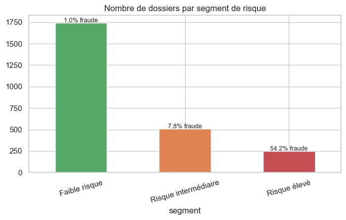
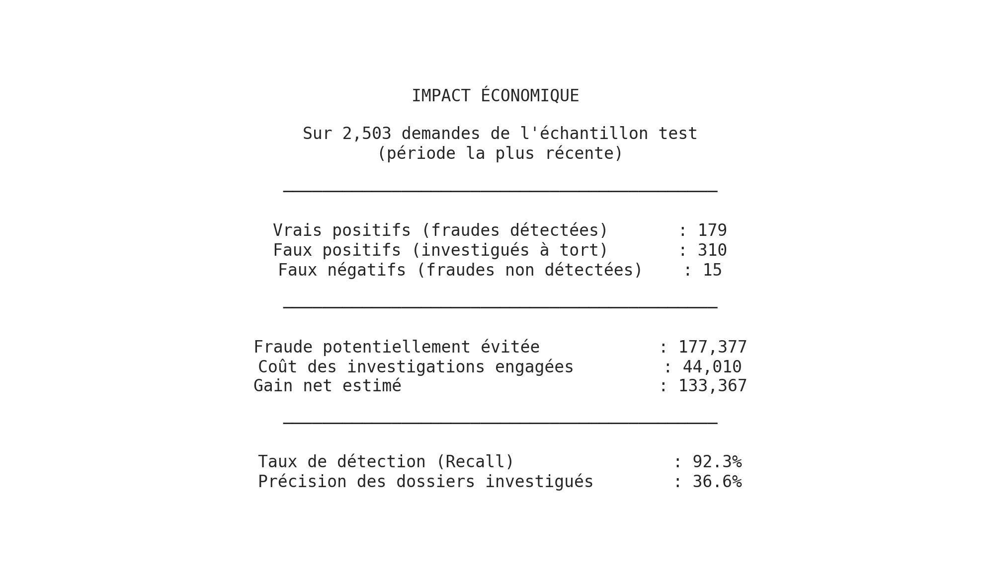

# Détection et scoring de fraude en Assurance santé

Ce projet construit un système de détection et de priorisation de la fraude aux demandes de remboursement en assurance santé : **apprentissage supervisé**, **détection d'anomalies**, **explicabilité**, **scoring** (de 0 à 100) et **évaluation économique**.

## Résultats clés

| Indicateur | Valeur |
|---|---|
| Modèle retenu | XGBoost (PR-AUC = 0,736) |
| Recall au seuil optimal | 92,3 % des fraudes détectées |
| Segment « Risque élevé » | 10 % des dossiers, **54,2 %** de fraude réelle (vs 8 % en moyenne) |
| Gain net estimé (test) | 133 367 *(sous hypothèses de coût — voir §7)* |

## Problème métier

Un organisme d'assurance santé reçoit un grand volume de demandes de remboursement soumises par des professionnels de santé. Une partie de ces demandes est frauduleuse (facturation fictive, surcotation, abus de volume), mais les équipes d'investigation ne peuvent pas contrôler l'ensemble des dossiers.

**Problématique** : comment identifier automatiquement les demandes les plus susceptibles d'être frauduleuses, afin de concentrer les ressources d'investigation sur les dossiers à risque, tout en limitant le volume de faux positifs et le coût des contrôles ?

L'objectif n'est pas de bloquer automatiquement une demande, mais de fournir un **outil d'aide à la décision** :

| Niveau de risque | Action recommandée |
|---|---|
| 🟢 Faible | Traitement automatique |
| 🟠 Intermédiaire | Contrôle léger / vérification documentaire |
| 🔴 Élevé | Investigation approfondie |

## Choix du jeu de données

Le dataset contient 10 000 demandes de remboursement liées à 300 professionnels de santé, avec une variable cible `Is_Fraud` (taux de fraude observé : 8,3 %) et des informations exploitables pour construire des variables comportementales et historiques : profil patient, montant facturé, spécialité et historique du professionnel, type de visite, délai entre la prestation et la déclaration. C'est un terrain représentatif d'un cas réel de fraude en assurance santé, avec un déséquilibre de classes marqué, condition centrale pour illustrer une méthodologie de détection de fraude de bout en bout.

**Point de vigilance méthodologique.** Deux variables du dataset (`Approved_Amount` et `Claim_Status`) se sont révélées être des **fuites de données** : elles encodaient en réalité une décision déjà informée par le statut de fraude (ex. montant approuvé quasi systématiquement réduit sur les dossiers frauduleux). Elles ont été **exclues des variables explicatives** après un contrôle dédié, une PR-AUC proche de 0,99 aurait sinon été obtenue, techniquement flatteuse mais inexploitable en production.

## Démarche d'analyse

1. **Qualité des données** : contrôle des valeurs manquantes (~3,5 % sur 3 variables, non informatives, imputées), détection des incohérences, étude du déséquilibre de la cible.
2. **Détection de fuites de données** : test systématique des variables à fort pouvoir séparateur avant modélisation (voir §2).
3. **Feature engineering** : montant facturé rapporté au profil de l'acte, délai prestation → facturation, `provider_taux_fraude_hist` (taux de fraude historique du professionnel, **calculé uniquement sur la période d'entraînement** pour éviter toute fuite), volume historique du professionnel.
4. **Split temporel** (plutôt qu'aléatoire) : 75 % des demandes les plus anciennes pour l'entraînement (7 497 demandes, 8,47 % de fraude), 25 % les plus récentes pour le test (2 503 demandes, 7,75 % de fraude), le modèle apprend sur le passé et doit détecter les fraudes futures, condition réaliste de mise en production.
5. **Modélisation** : trois modèles comparés avec pondération de classes, régression logistique (référence interprétable), Random Forest et XGBoost.
6. **Seuil de décision** : optimisation par fonction de coût métier (coût faux négatif vs faux positif), plutôt qu'un seuil par défaut de 0,5.
7. **Scoring et explicabilité** : transformation des probabilités en Fraud Score (0–100), analyse SHAP (importance globale et individuelle).
8. **Détection d'anomalies** : Isolation Forest, en complément du modèle supervisé.
9. **Segmentation et impact économique** : <ins>combinaison score supervisé et score d'anomalie</ins>, traduction en 3 niveaux de risque et chiffrage du gain net estimé.

## Insights découverts

**Comparaison des modèles** (échantillon test, seuil 0,5) :

| Modèle | Precision | Recall | F1 | ROC-AUC | PR-AUC |
|---|---|---|---|---|---|
| **XGBoost** | 0,567 | 0,680 | 0,618 | 0,960 | **0,736** |
| Logistic Regression | 0,397 | 0,897 | 0,551 | 0,958 | 0,678 |
| Random Forest | 0,453 | 0,804 | 0,580 | 0,955 | 0,623 |

XGBoost est retenu pour sa meilleure PR-AUC (métrique la plus pertinente compte tenu du déséquilibre de classes). La régression logistique atteint un Recall supérieur mais au prix d'une précision bien plus faible, un compromis à arbitrer selon la capacité d'investigation disponible.

- **Le montant facturé et l'historique du professionnel dominent le signal.** L'analyse SHAP identifie `Claim_Amount` et `provider_taux_fraude_hist` comme les facteurs les plus déterminants, devant les caractéristiques de procédure ou de spécialité.
- **Un délai de facturation court est un signal de fraude**, à l'inverse de l'intuition qu'on aurait en assurance auto (où une déclaration tardive est suspecte). Chaque jeu de données a sa propre logique comportementale ; les hypothèses ne se transposent pas d'un contexte à l'autre.
- **Le seuil optimal de coût (0,01) est très éloigné de 0,5.** Avec un coût de fraude non détectée (991) très supérieur au coût d'investigation (90), le seuil optimal fait chuter le coût total de 70 532 à 42 765 (-39,4 %). Un seuil fixé par défaut à 0,5 serait donc nettement sous-optimal ici.
- **La segmentation opérationnelle concentre efficacement le risque** : le segment « Risque élevé » (~10 % des dossiers test) affiche un taux de fraude réel de **54,2 %**, contre 1,0 % pour le segment « Faible risque ».

- **La détection d'anomalies apporte un signal complémentaire** : le taux de fraude atteint 24,7 % parmi les 10 % de dossiers jugés les plus atypiques par l'Isolation Forest, contre 7,8 % en moyenne, y compris pour des profils ne ressemblant pas exactement aux fraudes historiques.
- **Impact économique** : sur l'échantillon test, 179 fraudes détectées, 15 non détectées, 310 faux positifs (Recall 92,3 %, précision des dossiers investigués 36,6 %) ; fraude potentiellement évitée estimée à 177 377, pour un coût d'investigation de 44 010, soit un **gain net estimé de 133 367 sous les hypothèses de coût retenues** (il ne s'agit pas d'un gain garanti).

## Recommandations

1. **Prioriser les investigations sur le segment « Risque élevé »**, où le taux de fraude réel (54,2 %) est 7 fois supérieur à la moyenne.
2. **Adopter un scoring continu plutôt qu'une décision binaire**, pour adapter le niveau de contrôle (traitement automatique / contrôle léger / investigation) au niveau de risque.
3. **Combiner modèle supervisé et détection d'anomalies** : le premier capture les schémas de fraude déjà connus, le second repère les comportements atypiques inédits, les deux sont complémentaires, pas substituables.
4. **Traiter le modèle comme un outil d'aide à la décision**, jamais comme un système de blocage automatique : les équipes métier restent décisionnaires, en s'appuyant sur les facteurs explicatifs fournis par SHAP.
5. **Recalibrer les hypothèses de coût avec des données réelles** (coût moyen d'une fraude non détectée, coût d'une investigation) avant tout déploiement, le seuil optimal et le gain économique en dépendent directement.
6. **Mettre en place un suivi dans le temps** (dérive des données, évolution du taux de fraude, stabilité de la PR-AUC et du Recall) : les comportements frauduleux évoluent, un modèle figé perd en pertinence.

## Limites et prochaines étapes

- Les hypothèses de coût (991 / 90) sont des estimations à remplacer par des données réelles de l'assureur.
- Le taux de fraude historique d'un professionnel peut être peu fiable en cas de faible volume d'observations.
- Les explications SHAP identifient des associations, pas des relations causales.
- Prochaines étapes envisagées : calibration des probabilités et extension à une analyse de réseau (relations professionnel ↔ patient) pour détecter des schémas de fraude organisée.

## Exemple de scoring d'un client

